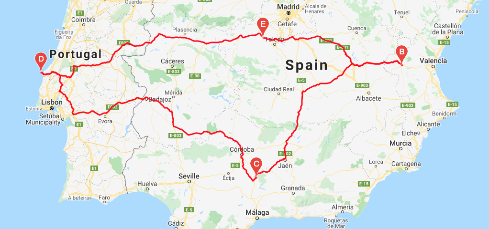

# PlanMyTrip World Weather Analysis

## Project Overview 
Jack, the head of analysis of the user interface team at PlanMyTrip loves the new app the analytics team just developed....and so far so do the Beta testers. Essentially the app current searches for the hotels based on the client's preferred travel criteria via the PlanMyTrip search page. But as with most products, improvements and enhancement can be made!   The Beta testers have brought forth some insightful recommendations! 

* First, the Beta testers would like to see the weather description incorporated into to the weather data currently being retrieved and presented. 
* Second, include input statements - to be filled out by the end-user - to filter/query the data based on weather preferences.  These filters will be used to identify and present potential travel destinations and nearby hotels. 
* Next, with the suggested destinations response, the end-users will be able to choose up to four (4) cities to create a travel itinerary. 
* Finally, with the use of Google Maps Directions API, a travel route between the four destination cities as well as a marker layer map will be created.

## Resources 
Python and a variety of imports and modules including:

* pandas
* matplotlib.pyplot
* numpy
* citipy
* requests
* datetime 
* gmaps

as well as **API keys** to access (request) data from Open Weather Map API and Google Cloud Platform API for directions.

This coding was done in **Jupyter Notebook** rather than Jupyter Lab as some of the maps were not rending properly with Jupyter Lab.

## Results
After collecting **2,000** random longitudes and latitudes, only **745 cities** were found.  The return rate of 37% is not surprising as 71%, or approximately 1/3, of the earth is covered in water!

Of those 745 cities, when applying the beta search criteria (end-user) of a minimum temperature of 70 degrees and a maximum of 90, **271 cities fit the criteria**.

Of the 271 cities found, 5 did not have complete information; specifically, they were missing country codes.

Of the remaining 266, hotels in 24 cities could not be found within the search parameters of 5,000 meters; resulting in **242 cities with nearby hotels **for our beta test.

## Output 
As an example of the itinerary output, after selecting four (4) cities in Spain and Portugal, the resulting directions map looks like:

## Summary
As with most projects, more enhancements will be on the horizon; the app is only half way done.  For example, a possible advancement may be to enable end-users to click on locations on a map to build itinerary.  Always room for improvement!